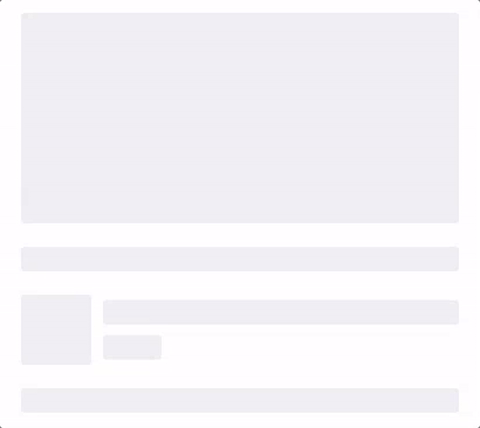
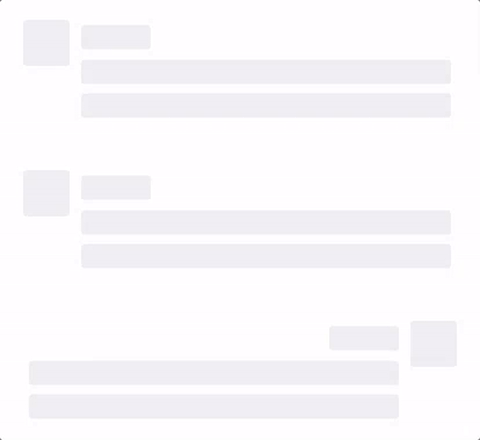
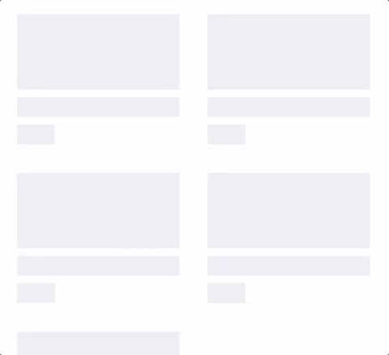
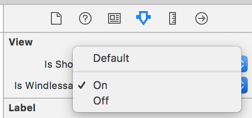
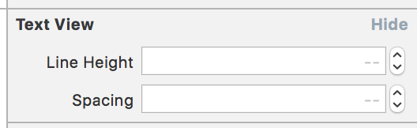
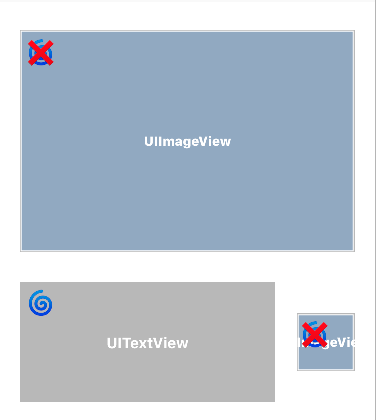
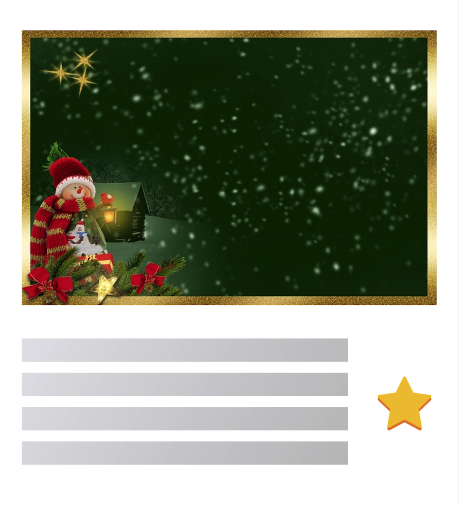
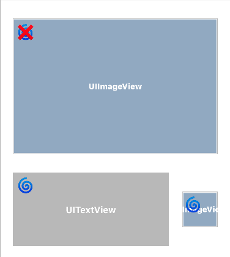
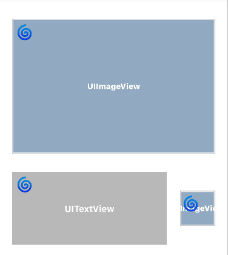

# Windless

[](https://github.com/Carthage/Carthage)
[](http://cocoapods.org/pods/Hero)


[](https://github.com/lkzhao/Hero/blob/master/LICENSE?raw=true)

**Windless** makes it easy to implement invisible layout loading view.

<table>
<tr>
<td width="25%">
</img>
</td>
<td width="25%">
</img>
</td>
<td width="25%">
</img>
</td>
</tr>
</table>

## Contents

- [Requirements](#requirements)
- [Installation](#installation)
- [Usage](#usage)
- [Looks](#looks)
- [Credits](#credits)
- [Communication](#communication)
- [License](#license)

## Requirements

- iOS 8.0+
- Xcode 9.0+
- Swift 4.0+

## Installation

### CocoaPods

[CocoaPods](http://cocoapods.org) is a dependency manager for Cocoa projects. You can install it with the following command:

```bash
$ gem install cocoapods
```

> CocoaPods 1.1+ is required to build Windless 4.0+.

To integrate Windless into your Xcode project using CocoaPods, specify it in your `Podfile`:

```ruby
source 'https://github.com/CocoaPods/Specs.git'
platform :ios, '8.0'
use_frameworks!

target '<Your Target Name>' do
    pod 'Windless', '~> 0.1.5'
end
```

Then, run the following command:

```bash
$ pod install
```

### Carthage

[Carthage](https://github.com/Carthage/Carthage) is a decentralized dependency manager that builds your dependencies and provides you with binary frameworks.

You can install Carthage with [Homebrew](http://brew.sh/) using the following command:

```bash
$ brew update
$ brew install carthage
```

To integrate Windless into your Xcode project using Carthage, specify it in your `Cartfile`:

```ogdl
github "Interactive-Studio/Windless" ~> 0.1.5
```

Run `carthage update` to build the framework and drag the built `Windless.framework` into your Xcode project.

### Manually

If you prefer not to use either of the aforementioned dependency managers, you can integrate Windless into your project manually.

---

## Usage


### Code

```swift
import Windless

class ViewController: UIViewController {

    lazy var contentsView = UIView()
    
    var subView1 = UIView()
    var subView2 = UIView()

    override func viewDidLoad() {
        super.viewDidLoad()

        self.view.addSubview(contentsView)
        contentsView.addSubview(subView1)
        contentsView.addSubview(subView2)
        
        // start
        contentsView.windless
                .setupWindlessableViews([subView1, subView2])
                .start()
                
        // stop
        contentsView.windless.end()
    }

}
```

### Storyboard, Xib

If you use **Storyboard** or **xib**, you only need to set the `isWindlessable` flag to true for the views you want to show as fake in the view inspector of the view, and you do not have to pass the view through the `setupWindlessableViews` method.



```swift
import Windless

class ViewController: UIViewController {

    @IBOutlet weak var contentsView: UIView!

    override func viewDidLoad() {
        super.viewDidLoad()

        contentsView.windless.start()
    }
}
```

### Multiline

Depending on the `lineHeight` value and the` spacing` value, UILabel and UITextView will reconstruct the layout when the windless animation runs.



```swift
public protocol CanBeMultipleLines {

    var lineHeight: CGFloat { get set }

    var spacing: CGFloat { get set }
}
```

### Custom Options

There are several customizable options in **Windless**.

```swift
public class WindlessConfiguration {
    
    /// The direction of windless animation. Defaults to rightDiagonal.
    public var direction: WindlessDirection = .rightDiagonal
    
    /// The speed of windless animation. Defaults to 1.
    public var speed: Float = 1
    
    /// The duration of the fade used when windless begins. Defaults to 0.
    public var beginTime: CFTimeInterval = 0
    
    /// The time interval windless in seconds. Defaults to 4.
    public var duration: CFTimeInterval = 4
    
    /// The time interval between windless in seconds. Defaults to 2.
    public var pauseDuration: CFTimeInterval = 2
    
    /// gradient animation timingFunction default easeOut
    public var timingFuction: CAMediaTimingFunction = .easeOut
    
    /// gradient layer center color default .lightGray
    public var animationLayerColor: UIColor = .lightGray
    
    /// Mask layer background color default .groupTableViewBackground
    public var animationBackgroundColor: UIColor = .groupTableViewBackground
    
    /// The opacity of the content while it is windless. Defaults to 0.8.
    public var animationLayerOpacity: CGFloat = 0.8
}
```

To set the options, use the apply method as shown below.

```swift
import Windless

class ViewController: UIViewController {

    @IBOutlet weak var contentsView: UIView!

    override func viewDidLoad() {
        super.viewDidLoad()

        contentsView.windless
            .apply {
                $0.beginTime = 1
                $0.pauseDuration = 2
                $0.duration = 3
                $0.animationLayerOpacity = 0.5
            }
            .start()
    }
}
```

If you want to know more detailed usage, please refer to Example.

## Looks

The `isWindlessable` value determines how the loading view looks. The images below show how the loading screen will look according to the `isWindlessable` value.

> ```isWindlessable```= 🌀

| Configuration | Result
|------- | -------
| |  
| |  
| |  

## Communication

- If you **found a bug**, open an issue.
- If you **have a feature request**, open an issue.
- If you **want to contribute**, submit a pull request.

## Credits

- GwangBeom Park ([@gwangbeom](https://github.com/ParkGwangBeom))

## License

Windless is released under the MIT license. See LICENSE for details.

